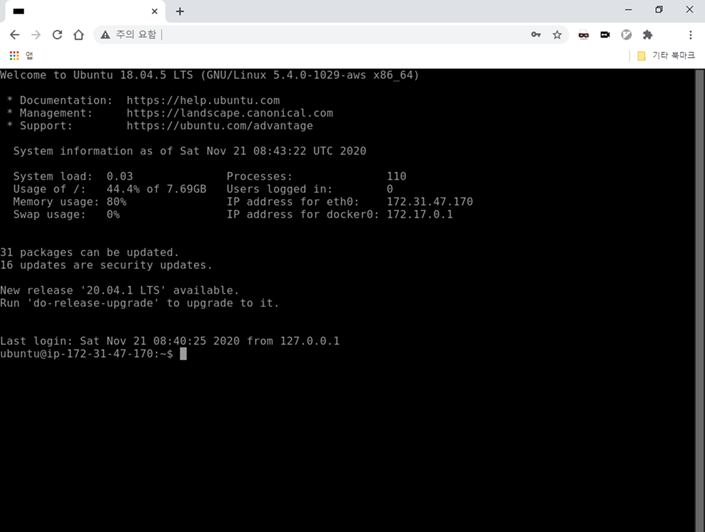

# One-step setting for Guacamole on SSajibang computer using docker compose

## Screenshots

## Usage

1. `sudo apt-get install docker-compose` (For ubuntu only; Use the package manager of your own linux distribution.)
1. Clone this repo: `git clone https://github.com/GyunghunKim/Dockerfiles.git`.
1. Move into the cloned folder: `cd (cloned-dir)/Dockerfiles/guacamole`.
1. Just type `sudo docker-compose up -d` on your terminal.
1. Enjoy guacamole at `http://your-ip-here/` on web browser.

NOTE: Initial ID and password are respectively guacadmin and guacadmin. (***YOU MUST CHANGE IT AT THE VERY FIRST!***)

## Troubleshooting

### 1. Problems on ssh

- Allow password authentication at the configuation file: `/etc/ssh/sshd_config`.
- Don't forget to restart the service using `systemctl`: `sudo systemctl restart
  ssh`.
- In guacamole setting page, set the host as `localhost` and the port as `22`.

## TODOs

- Simple setting script for a GUI setting for an incipient server.
- More instructions for the GUI setting as well as the SSH in detail.
